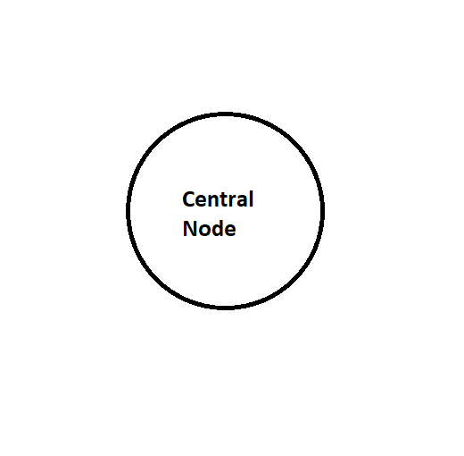
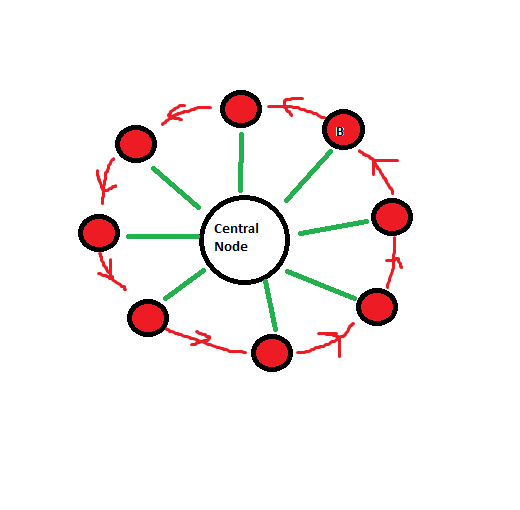
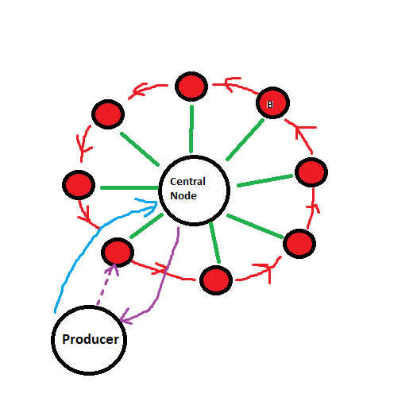
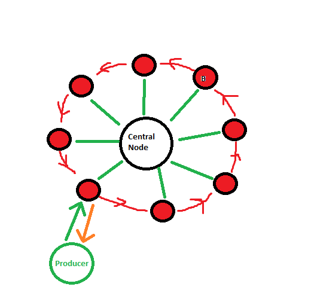
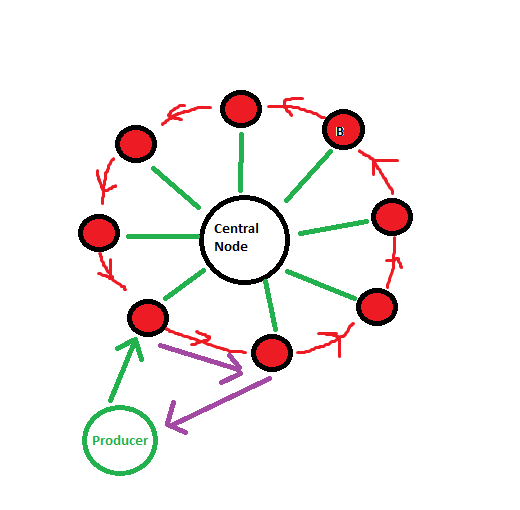

# Distributed Buffer
## Description
* Firstly was createn central node and few buffers nodes. 

* Central node is setting customers or producers first buffer adress. 

* Customer or Producer can do operation *put* or *get* with his buffer addres. 

* If buffer can do this, it will do this. If buffer can't do this,  it will send command to his neightbour. If neightbour can do this operation, it will do this. Otherwise it will send to 
his next neightbour. And again, and again and ....
* When comend's finds buffer, which can do commend. Buffer will do commed and send response to Customer/Producer with himself address.

## Buffer overflow
Presently is not exist mechanism to protection buffer from overflow. If buffer can't do command, command will be sent to neighbors again and again ...
